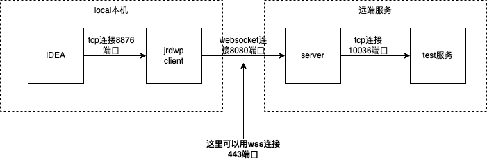
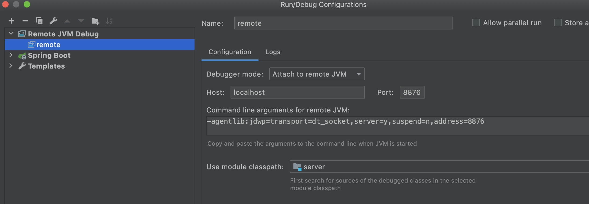
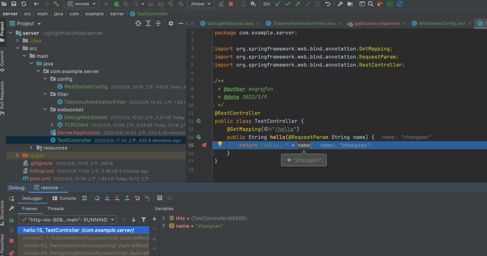

## 功能说明
本机远程调试java程序demo，和[jrdwp](https://github.com/leonlee/jrdwp)的区别是服务端走的是Spring boot websocket，而不需要在nginx中进行配置。

- 客户端：客户端由go jrdwp实现，因为打包的go客户端打包成二进制后可以直接运行
- 服务端：由spring boot的websocket中转数据，然后通过tcpclient代理到具体的远端java应用
- 因为交互的数据比较多，远程调试的时候速度会比较慢


## 使用步骤demo

1. 打包java服务，启动两个服务，1个用来当成远端java服务，1个用来当做websocket服务。注意为了偷懒2个JAVA服务都使用了server的jar包
```
#进入服务端目录
cd server
mvn clean package -DskipTests
# 启动远端需要测试的服务，开放了10036端口做为jdwp调试端口, 启动8081端口做为服务
./start-remote.sh
# 启动调试服务端，websocket服务使用8080端口
./start-server.sh
```

2. 打包go客户端，启动jrdwp客户端
客户端也可以通过wss访问https的服务端`-server-host=debug.xxx.com -server-port=443 -ws-schema=wss`
```
# 进入代码的go目录
cd go
# 编译生成jrdwp运行程序
go build jrdwp.go
# 开放一个本地8876端口给到idea调试
./start-client
```

3. idea打开server启动远程调试

- 新增一个`Remote JVM Debug` 调试的配置，端口连接到本机的8876
- 在TestController.hello方法中间打上断点

4. 浏览器访问http://localhost:8081/hello?name=zhangsan
在浏览器访问以后可以发现我们成功进入了IDEA的断点


## 后续优化
本地启动客户端这一步可以通过请求远端服务进行优化, 因为懒惰只写一个思路
- 本地请求：`sh -c "$(curl 'https://debug.xxx.com/jrdwp/operation?server=localhost:10036')"`
- 响应的脚本执行以下步骤
	- 下载jrdwp到本地, wget或者curl命令下载
	- 赋予jrdwp执行权限，chmod u+x jrdwp
	- 启动jrdwp客户端